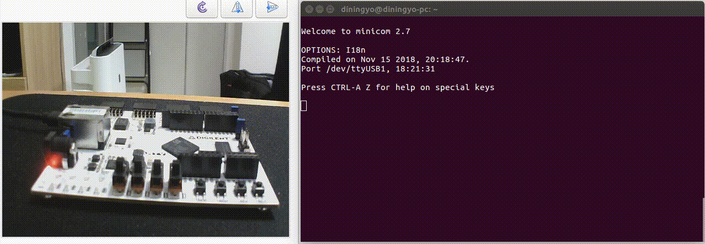
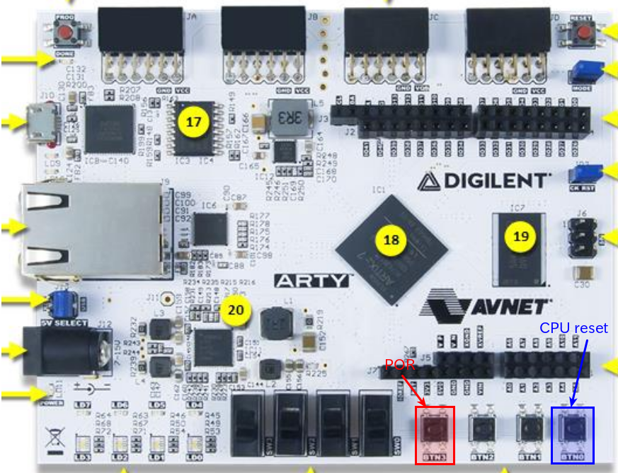

# dirv

Chiselで書いたRISC-Vのお試し実装

## 概要

- RV32I
- Machine mode Only
- User-Level ISA Version 2.2
- Privileged ISA Version 1.10
- 割り込みは未サポート
- 2ステージパイプライン　(Fetch - Decode/Execute/Memory/Write back)
- Interface Protocol - オリジナル
- UCバークレーで開発されたハードウェア構築言語であるChiselで実装
  - Chiselの詳細については[公式のウェブサイト](https://chisel.eecs.berkeley.edu/)を参照ください。

## デモ

Arty 35Tで以下のように動作することを確認しています。



## 動作に必要なもの

- Java 8.0 (Scalaのため)
- sbt
- verilator
- RV32Iのビルド環境（riscv-testsを実行する場合）
- Vivado 2018.3(FPGAの合成を行う場合)
- [ARTY 35T](https://japan.xilinx.com/products/boards-and-kits/arty.html)(FPGAで動作を確認する場合)

## 動かし方

本リポジトリのデータをクローン or ダウンロードしてください。

```bash
$ git clone https://github.com/diningyo/dirv.git
$ cd dirv
$ git submodule update --init --recursive
```

### RTLの生成

sbtシェル上から以下のコマンドを実行。

```scala
$ sbt
sbt:dirv> runMain Elaborate
```

### riscv-testsの実行

1. riscv-testsのビルド
    1. 事前にRISC-Vのクロスコンパイラの設定が必要

```bash
$ cd src/test/resources/
$ patch -p0 < riscv-tests.patch
$ cd riscv-tests
$ ./configure --with-xlen=32
$ make isa
$ cd ../../../
```

2. sbtシェル上で次のコマンドを実行

```scala
$ sbt
sbt:dirv> testOnly DirvRV32ITester
```

実行すると以下の様になります。

```scala
[info] DirvRV32ITester:
[info] Dirv
[info] - must execute RISC-V instruction add        - [riscv-tests:rv32ui-000]
[info] - must execute RISC-V instruction addi       - [riscv-tests:rv32ui-001]
[info] - must execute RISC-V instruction and        - [riscv-tests:rv32ui-002]
[info] - must execute RISC-V instruction andi       - [riscv-tests:rv32ui-003]
[info] - must execute RISC-V instruction auipc      - [riscv-tests:rv32ui-004]
[info] - must execute RISC-V instruction beq        - [riscv-tests:rv32ui-005]
[info] - must execute RISC-V instruction bge        - [riscv-tests:rv32ui-006]
[info] - must execute RISC-V instruction bgeu       - [riscv-tests:rv32ui-007]
[info] - must execute RISC-V instruction blt        - [riscv-tests:rv32ui-008]
[info] - must execute RISC-V instruction bltu       - [riscv-tests:rv32ui-009]
[info] - must execute RISC-V instruction bne        - [riscv-tests:rv32ui-010]
[info] - must execute RISC-V instruction fence_i    - [riscv-tests:rv32ui-011]
[info] - must execute RISC-V instruction jal        - [riscv-tests:rv32ui-012]
[info] - must execute RISC-V instruction jalr       - [riscv-tests:rv32ui-013]
[info] - must execute RISC-V instruction lb         - [riscv-tests:rv32ui-014]
[info] - must execute RISC-V instruction lbu        - [riscv-tests:rv32ui-015]
[info] - must execute RISC-V instruction lh         - [riscv-tests:rv32ui-016]
[info] - must execute RISC-V instruction lhu        - [riscv-tests:rv32ui-017]
[info] - must execute RISC-V instruction lui        - [riscv-tests:rv32ui-018]
[info] - must execute RISC-V instruction lw         - [riscv-tests:rv32ui-019]
[info] - must execute RISC-V instruction or         - [riscv-tests:rv32ui-020]
[info] - must execute RISC-V instruction ori        - [riscv-tests:rv32ui-021]
[info] - must execute RISC-V instruction sb         - [riscv-tests:rv32ui-022]
[info] - must execute RISC-V instruction sh         - [riscv-tests:rv32ui-023]
[info] - must execute RISC-V instruction simple     - [riscv-tests:rv32ui-024]
[info] - must execute RISC-V instruction sll        - [riscv-tests:rv32ui-025]
[info] - must execute RISC-V instruction slli       - [riscv-tests:rv32ui-026]
[info] - must execute RISC-V instruction slt        - [riscv-tests:rv32ui-027]
[info] - must execute RISC-V instruction slti       - [riscv-tests:rv32ui-028]
[info] - must execute RISC-V instruction sltiu      - [riscv-tests:rv32ui-029]
[info] - must execute RISC-V instruction sltu       - [riscv-tests:rv32ui-030]
[info] - must execute RISC-V instruction sra        - [riscv-tests:rv32ui-031]
[info] - must execute RISC-V instruction srai       - [riscv-tests:rv32ui-032]
[info] - must execute RISC-V instruction srl        - [riscv-tests:rv32ui-033]
[info] - must execute RISC-V instruction srli       - [riscv-tests:rv32ui-034]
[info] - must execute RISC-V instruction sub        - [riscv-tests:rv32ui-035]
[info] - must execute RISC-V instruction sw         - [riscv-tests:rv32ui-036]
[info] - must execute RISC-V instruction xor        - [riscv-tests:rv32ui-037]
[info] - must execute RISC-V instruction xori       - [riscv-tests:rv32ui-038]
[info] - must execute RISC-V instruction breakpoint - [riscv-tests:rv32mi-000]
[info] - must execute RISC-V instruction csr        - [riscv-tests:rv32mi-001]
[info] - must execute RISC-V instruction illegal    - [riscv-tests:rv32mi-002]
[info] - must execute RISC-V instruction ma_addr    - [riscv-tests:rv32mi-003]
[info] - must execute RISC-V instruction ma_fetch   - [riscv-tests:rv32mi-004]
[info] - must execute RISC-V instruction mcsr       - [riscv-tests:rv32mi-005]
[info] - must execute RISC-V instruction sbreak     - [riscv-tests:rv32mi-006]
[info] - must execute RISC-V instruction scall      - [riscv-tests:rv32mi-007]
[info] - must execute RISC-V instruction shamt      - [riscv-tests:rv32mi-008]
[info] ScalaTest
[info] Run completed in 1 minute, 57 seconds.
[info] Total number of tests run: 48
[info] Suites: completed 1, aborted 0
[info] Tests: succeeded 48, failed 0, canceled 0, ignored 0, pending 0
[info] All tests passed.
[info] Passed: Total 48, Failed 0, Errors 0, Passed 48
```

#### 波形を取得したい場合

```scala
sbt:dirv> testOnly dirv.DirvRV32ITester -D--generate-vcd-output=on
```

#### 特定のテストを実行したい場合

以下のいずれかで特定のテストを実行可能です。

```scala
sbt:dirv> testOnly dirv.DirvRV32ITester -- -z <テスト名>
sbt:dirv> testOnly dirv.DirvRV32ITester -- -z <テスト番号>
```

下記のログの以下の部分がテスト名/テスト番号に対応しています。

 - テスト名  : add
 - テスト番号: rv32ui-000

```scala
[info] - must execute RISC-V instruction add        - [riscv-tests:rv32ui-000]
```

## ブロック図


## 外部インターフェースの動作

AXIに似たコマンドとデータが分離されたready-valid型のバス・プロトコルになっています。<br>
AXIとの違いは以下の通りです：

- コマンドはリード/ライトで共通でデータはリード/ライトが分離
- バーストアクセスは非対応
- コマンドには以下のフィールドのみでAXIにあるようなCacheやProtといったものが存在しない
  - アドレス
  - コマンド(read/writeの選択)
  - サイズ(byte/half word/word)
- ライトはデータチャネルでレスポンスが返ってくる

### 端子

|端子名|入出力|ビット幅|説明|
|:----|:----|:----|:----|
|**コマンド・チャネル**||||
|valid|O|1|コマンドのvalid信号|
|ready|I|1|コマンドのready信号|
|cmd|O|1|コマンド(0:read/1:write)|
|addr|O|32|アクセス先のアドレス|
|size|O|2|アクセスのサイズ(0:byte/1:half word/2:word)|
|**ライトデータ・チャネル**|-|-|-|
|w_valid|O|1|ライトデータのvalid信号|
|w_ready|I|1|ライトデータのready信号|
<!--|w_resp|I|1|ライトのエラー応答(0:OK/1:Error)|-->
|w_strb|O|1|ライトのstrobe信号|
|w_data|O|32|ライトデータ|
|**リードデータ・チャネル**||||
|r_valid|I|1|リードデータのvalid信号|
|r_ready|O|1|リードデータのready信号|
|r_resp|I|1|エラー応答(0:OK/1:Error)|
|r_data|I|32|リードデータ|

### リード


### ライト


## 外部インターフェースの動作

AXIっぽくコマンドとデータが分離されたready-valid型のバス・プロトコルになっています。<br>
AXIとの違いは以下の通りです：

- コマンドはリード/ライトで共通でデータはリード/ライトが分離
- バーストアクセスは非対応
- コマンドには以下のフィールドのみでAXIにあるようなCacheやProtといったものが存在しない
  - アドレス
  - コマンド(read/writeの選択)
  - サイズ(byte/half word/word)
- ライトはデータチャネルでレスポンスが返ってくる

### 端子

|端子名|入出力|ビット幅|説明|
|:----|:----|:----|:----|
|**コマンド・チャネル**||||
|valid|O|1|コマンドのvalid信号|
|ready|I|1|コマンドのready信号|
|cmd|O|1|コマンド(0:read/1:write)|
|addr|O|32|アクセス先のアドレス|
|size|O|2|アクセスのサイズ(0:byte/1:half word/2:word)|
|**ライトデータ・チャネル**|-|-|-|
|w_valid|O|1|ライトデータのvalid信号|
|w_ready|I|1|ライトデータのready信号|
|w_resp|I|1|ライトのエラー応答(0:OK/1:Error)|
|w_strb|O|1|ライトのstrobe信号|
|w_data|O|32|ライトデータ|
|**リードデータ・チャネル**||||
|r_valid|I|1|リードデータのvalid信号|
|r_ready|O|1|リードデータのready信号|
|r_resp|I|1|エラー応答(0:OK/1:Error)|
|r_data|I|32|リードデータ|

### リード


### ライト


## FPGA合成環境

本リポジトリにはDIGILENT社のARTY 35T向けのFPGAのプロジェクトが含まれています。
以下に示す手順で動作確認が可能です。

### サンプルプログラムのビルド

```bash
cd src/main/resources/csrc
make
```

### 合成

以下のプロジェクトをVivadoで開き`Generate Bitstread`をおしてビットストリームを生成。

```bash
vivado fpga/arty/dirv-arty.xpr
```

### 実行

作成したビットストリーム（fpga/arty/dirv-arty.runs/impl_1/dirv_fpga_top.bit）をFPGAに転送。
その後ターミナルから`/dev/ttyUSB1`に接続。

```bash
minicom -D /dev/ttyUSB1 -b 9600
```

リセットボタンを押すと、[デモ](##デモ)の通り、ターミナルに"Hello, World!!"と表示される



## TODO

- 3ステージ版/5ステージ版の作成
- 割り込みのサポート
- C-extensionのサポート
- M-extensionのサポート
- riscv-complianceテストの評価
- coremarkの評価
- FPGA実装
- AXI IF wrapperの作成
