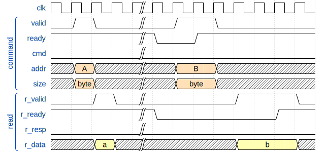
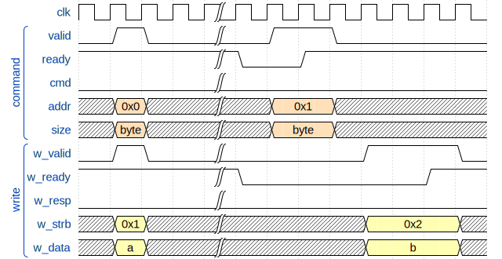

# dirv

Chiselで書いたRISC-Vのお試し実装

## 概要

- RV32I
- Machine mode Only
- User-Level ISA Version 2.2
- Privileged ISA Version 1.10
- 割り込みは未サポート
- 2ステージパイプライン　(Fetch - Decode/Execute/Memory/Write back)
- Interface Protocol - オリジナル
- UCバークレーで開発されたハードウェア構築言語であるChiselで実装
  - Chiselの詳細については[公式のウェブサイト](https://chisel.eecs.berkeley.edu/)を参照ください。


## 動作に必要なもの

- Java 8.0 (Scalaのため)
- sbt
- verilator
- RV32Iのビルド環境（riscv-testsを実行する場合）

## 動かし方

本リポジトリのデータをクローン or ダウンロードしてください。

```bash
$ git clone https://github.com/diningyo/dirv.git
$ cd dirv
$ git submodule update --init --recursive
```

### RTLの生成

sbtシェル上から以下のコマンドを実行。

```scala
$ sbt
sbt:dirv> runMain Elaborate
```

### riscv-testsの実行

1. riscv-testsのビルド

```bash
$ cd src/test/resources/
$ cd riscv-tests
$ ./configure --with-xlen=32
$ cd ..
$ patch -p0 < riscv-tests.patch 
$ make isa
$ cd ../../../
```

2. sbtシェル上で次のコマンドを実行

```scala
$ sbt
sbt:dirv> test
```

実行すると以下の様になります。


#### 波形を取得したい場合

```scala
sbt:dirv> testOnly dirv.DirvRV32ITester -D--generate-vcd-output=on
```

#### 特定のテストを実行したい場合

以下のいずれかで特定のテストを実行可能です。

```scala
sbt:dirv> testOnly dirv.DirvRV32ITester -- -z <テスト名>
sbt:dirv> testOnly dirv.DirvRV32ITester -- -z <テスト番号>
```

下記のログの以下の部分がテスト名/テスト番号に対応しています。

 - テスト名  : add
 - テスト番号: rv32ui-000

```scala
[info] - must execute RISC-V instruction add        - [riscv-tests:rv32ui-000]
```
## 外部インターフェースの動作

AXIっぽくコマンドとデータが分離されたready-valid型のバス・プロトコルになっています。<br>
AXIとの違いは以下の通りです：

- コマンドはリード/ライトで共通でデータはリード/ライトが分離
- バーストアクセスは非対応
- コマンドには以下のフィールドのみでAXIにあるようなCacheやProtといったものが存在しない
  - アドレス
  - コマンド(read/writeの選択)
  - サイズ(byte/half word/word)
- ライトはデータチャネルでレスポンスが返ってくる

### 端子

|端子名|入出力|ビット幅|説明|
|:----|:----|:----|:----|
|**コマンド・チャネル**||||
|valid|O|1|コマンドのvalid信号|
|ready|I|1|コマンドのready信号|
|cmd|O|1|コマンド(0:read/1:write)|
|addr|O|32|アクセス先のアドレス|
|size|O|2|アクセスのサイズ(0:byte/1:half word/2:word)|
|**ライトデータ・チャネル**|-|-|-|
|w_valid|O|1|ライトデータのvalid信号|
|w_ready|I|1|ライトデータのready信号|
|w_resp|I|1|ライトのエラー応答(0:OK/1:Error)|
|w_strb|O|1|ライトのstrobe信号|
|w_data|O|32|ライトデータ|
|**リードデータ・チャネル**||||
|r_valid|I|1|リードデータのvalid信号|
|r_ready|O|1|リードデータのready信号|
|r_resp|I|1|エラー応答(0:OK/1:Error)|
|r_data|I|32|リードデータ|

### リード



### ライト


## 外部インターフェースの動作

AXIっぽくコマンドとデータが分離されたready-valid型のバス・プロトコルになっています。<br>
AXIとの違いは以下の通りです：

- コマンドはリード/ライトで共通でデータはリード/ライトが分離
- バーストアクセスは非対応
- コマンドには以下のフィールドのみでAXIにあるようなCacheやProtといったものが存在しない
  - アドレス
  - コマンド(read/writeの選択)
  - サイズ(byte/half word/word)
- ライトはデータチャネルでレスポンスが返ってくる

### 端子

|端子名|入出力|ビット幅|説明|
|:----|:----|:----|:----|
|**コマンド・チャネル**||||
|valid|O|1|コマンドのvalid信号|
|ready|I|1|コマンドのready信号|
|cmd|O|1|コマンド(0:read/1:write)|
|addr|O|32|アクセス先のアドレス|
|size|O|2|アクセスのサイズ(0:byte/1:half word/2:word)|
|**ライトデータ・チャネル**|-|-|-|
|w_valid|O|1|ライトデータのvalid信号|
|w_ready|I|1|ライトデータのready信号|
|w_resp|I|1|ライトのエラー応答(0:OK/1:Error)|
|w_strb|O|1|ライトのstrobe信号|
|w_data|O|32|ライトデータ|
|**リードデータ・チャネル**||||
|r_valid|I|1|リードデータのvalid信号|
|r_ready|O|1|リードデータのready信号|
|r_resp|I|1|エラー応答(0:OK/1:Error)|
|r_data|I|32|リードデータ|

### リード


### ライト


## TODO

- 3ステージ版/5ステージ版の作成
- 割り込みのサポート
- C-extensionのサポート
- M-extensionのサポート
- riscv-complianceテストの評価
- coremarkの評価
- FPGA実装
- AXI IF wrapperの作成
